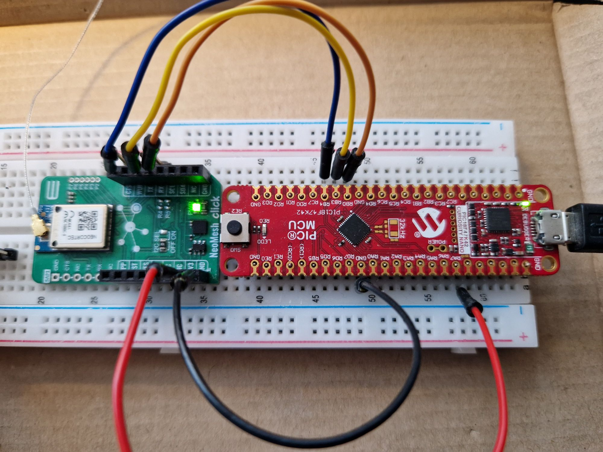

# **neo.api**

This README file describes how-to setup and build the *neo.api* demo examples. 
The *neo.api* documentation can be found here: *software/doc/html/index.html*

## PIC18F47K42

### **Setup build environment**

*neo.api* has been implemented on the 
[PIC18F47K42 CURIOSITY NANO EVALUATION KIT](https://www.microchip.com/en-us/development-tool/DM182028) connected to the [MikroE Click Boards™ - NeoCortec](https://neocortec.com/neocortec-now-on-mikroe-click-boards/)

 

Pin connection between the two boards:
|Eval. kit  |MikroE board|
|-----------|------------|
| RB4       | CTS |
| RB3       | TX  |
| RB0       | RX  |
| GND       | GND |
| 3V3       | 3V3 |

Please install *MPLAB X IDE* version v6.25 or newer with the integrated MPLAB Code Configurater from Microchip to build the project on Windows 10/11.

Connect a serial terminal program (PuTTY or similar) to the *Curiosity Virtual COM Port* and use these communication settings: 115200,n,8,1

### Build

 Build the demo:
1. Start *MPLAB X IDE* and open the project in the *software\src\examples\PIC18F47K42_2_MikroE_NeoMesh_click.X* folder
2. Build and download the demo to the evaluation kit. 

### Run

Run/debug the demo:

- UART2 implements a standard serial terminal interface (115200,n,8,1) to enter single character commands:  
PIC18F47K42 CNANO - NeoMesh NcApi Example 
Commands: 
i - Node Info Request 
n - Neighbor List Request 
r - Route Info Request 
s - Send unacknowledged message 
h - Help  
(Please see the *neo.api* documentation in *software/doc/html/index.html* for a detailed description of the commands.)

- The NeoMesh node is configured with NeoMesh node id 0x0010.
- When sending data to another device, the example code expects another NeoMesh device in the network with node id 0x0011.
- LED0 is set to toggle on the CTS signal from NeoMesh
- Please see the *MPLAB CC* for detailed configuration of the board.
- Please see the main loop in the main.c file in the example for the implementation of commands.

## **Changelog**

## **License**